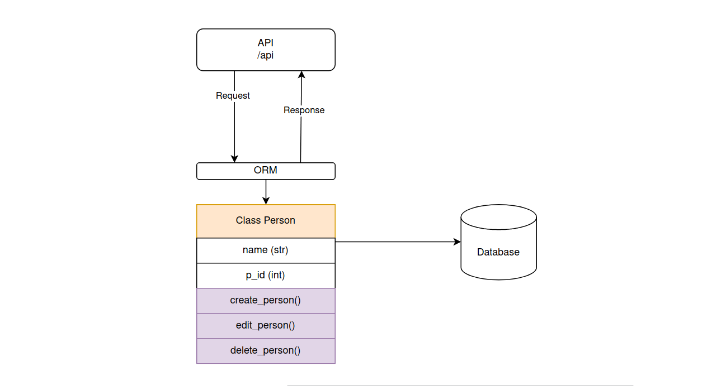

## Person API

This project is a simple REST API capable of performing CRUD operations on person resource
It can dynamically handle parameters such as adding a person by name, retriving person by name etc.

## Table of contents
- [Installation](#installation)
- [Configuration](#configuration)
- [Endpoints](#endpoints)
- [Usage](#setup-and-usage)
## UML


## installation
Clone this repository from github to your local dev environment using the command

```
git clone https://githhub.com/Itsfoss0/hngx_internship.git
```
Navigate to the `0x1-poeple` directory and install the reuired packages using the commmand

```
cd 0x1-poeple

pip install -r requirements.txt
```

## configuration
After installing all the required dependencies, you will need to configure a database (this project uses mysql). Fire up your terminal and configure the following enviroment variables. For persitence, I suggest to add them to your defualt shell's reource config file. I'll use bash to demonstrate this, so we will add them to `~/.bashrc`

```shell
export DB_HOST=localhost
export DB_NAME=my_db
export DB_PASSWORD=hnguser@hngx10
export DB_USER=hngxadmin
export DB_PORT=3306
```

## Endpoints
__/api__
```http
GET /api
Content-Type: appplication/json
Status: 200 OK
{
"users": [
    {
        "id": 1,
        "name": "Holga Kilgore"
    },
    {
        "id": 2,
        "name": "Taylor Shaw"
    }
]
}
```

```http
POST /api
Content-Type: application/json
Status: 200 OK

{
"message": {
    "user": "Jane Doe"
}
}
```


__/api/:id__

```http
GET /api/4
Content-Type: application/json
Status: 200 OK
{
    "id" : 4,
    "name": "Holga"
}
```


```
PUT /api/4
Content-Type: application/json
Status: 200 OK

{
    "message": "User updated to Kilgore"
}
```

```
DELETE /api/4
Content-Type: application/json
Status: 200 OK

{
    "message": "User id 4 deleted"
}
```

__/api/:name__

```http
GET /api/john
Content-Type: application/json
Status: 200 OK
{
    "id" : 4,
    "name": "john"
}
```


```
PUT /api/john
Content-Type: application/json
Status: 200 OK

{
    "message": "User updated to Doe"
}
```

```
DELETE /api/doe
Content-Type: application/json
Status: 200 OK

{
    "message": "User doe deleted"
}
```
## Assumptions
It has been assumed that you know how to create a mysql user and grant the correct priviledges. If not, please head over to the more detailed [Documentation](./DOCUMENTATION.md) guide

we have assumed that all users will have unique names, so using the name in place of id should work just fine. What this means is that 

```
GET /api

```

And

```
GET /api/:name
```
Should have the same idempotent effect.

## Usage
Here is the API in action

In one terminal window, start the application using the command `python3 -m api.v1.app`
```shell
┌─[itsfoss@itsfoss]─[~/Desktop/hngx_internship/0x1-people]
└──╼ $python3 -m api.v1.app
 * Serving Flask app "app" (lazy loading)
 * Environment: production
   WARNING: This is a development server. Do not use it in a production deployment.
   Use a production WSGI server instead.
 * Debug mode: off
 * Running on http://127.0.0.1:5000/ (Press CTRL+C to quit)
```

Open up a second window that we will use for making the requests. We will use `curl`

```shell
┌─[itsfoss@itsfoss]─[~/Desktop/hngx_internship/0x1-people]
└──╼ $curl 0:5000/api
{"users":[{"id":4,"name":"john"},{"id":7,"name":"miranda"},{"id":8,"name":"taylor"}]}
┌─[itsfoss@itsfoss]─[~/Desktop/hngx_internship/0x1-people]
└──╼ $
```

```shell
┌─[itsfoss@itsfoss]─[~/Desktop/hngx_internship/0x1-people]
└──╼ $curl 0:5000/api/john
{"id":4,"name":"john"}
┌─[itsfoss@itsfoss]─[~/Desktop/hngx_internship/0x1-people]
└──╼ $

```

```shell
┌─[itsfoss@itsfoss]─[~/Desktop/hngx_internship/0x1-people]
└──╼ $curl -X PUT -H "Content-Type: application/json"  -d'{"name":"Doe"}' 0:5000/api/4
{"message":"User updated to Doe"}
```
More details can be found in the [Documentation](./DOCUMENTATION.md)